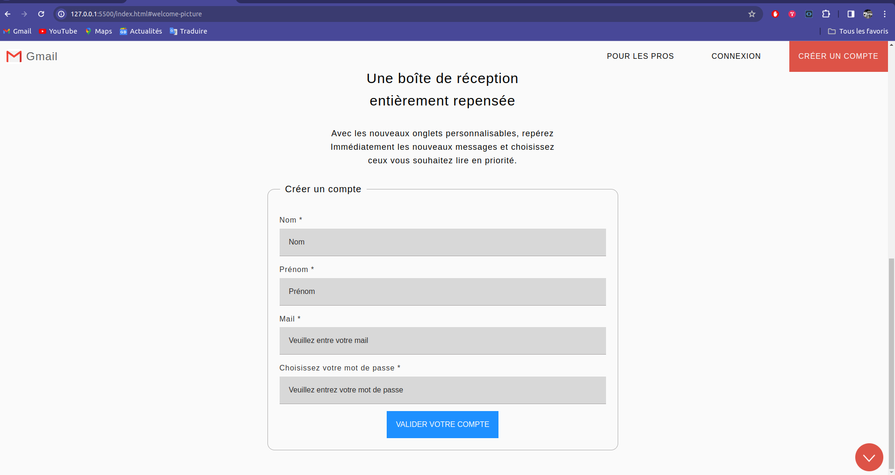
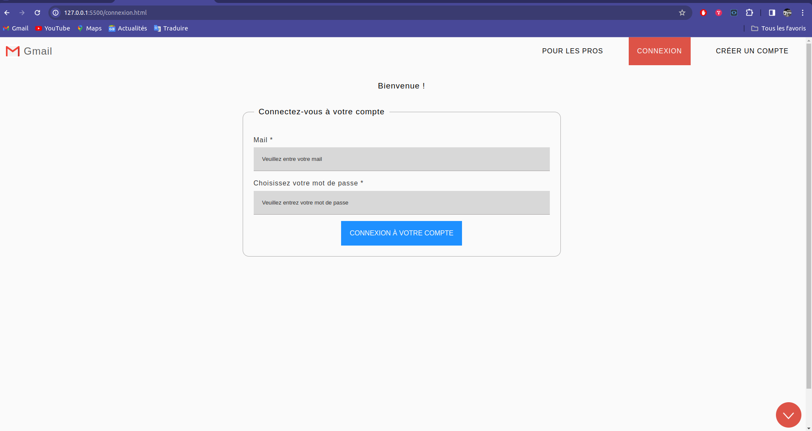
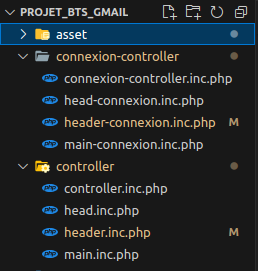
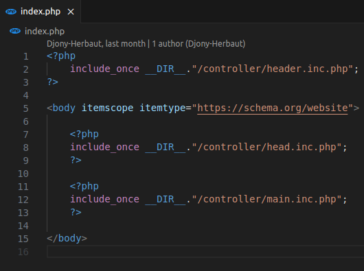
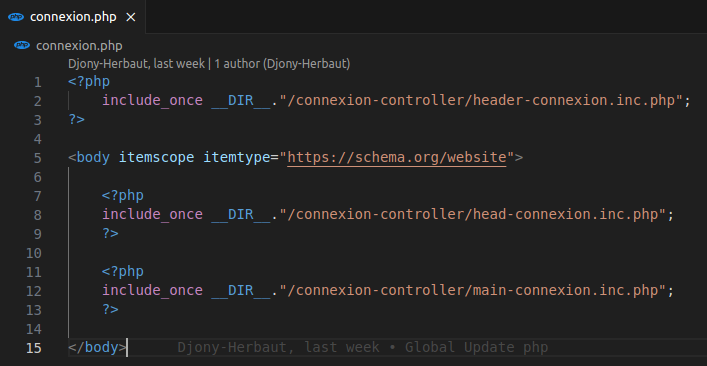
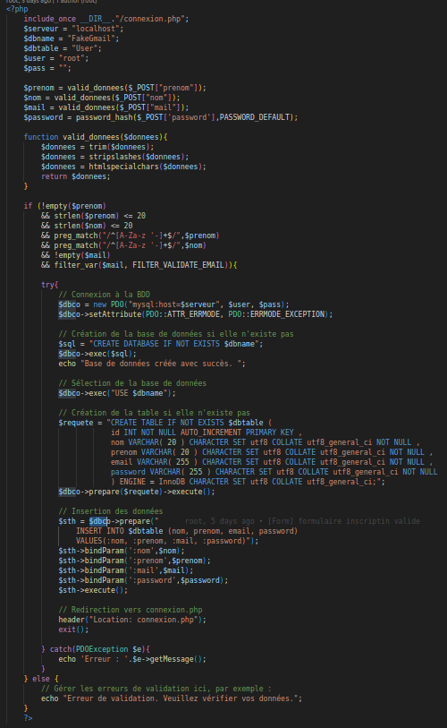
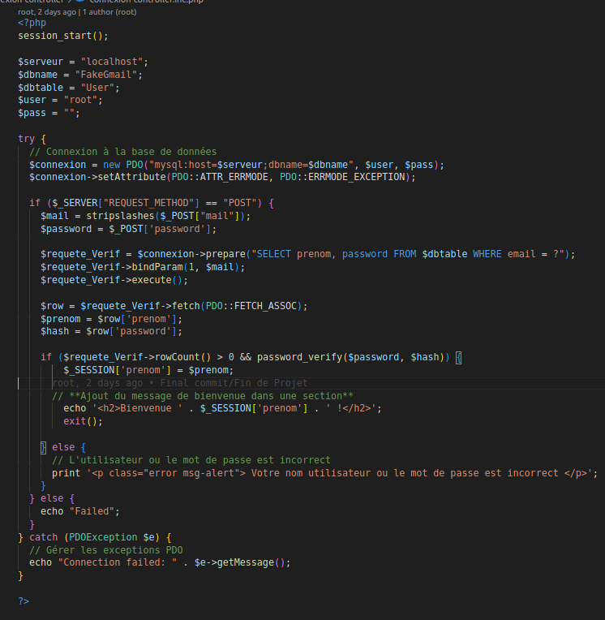

# Le Lien du site [ ici](https://djony-herbaut.github.io/Projet_BTS_Gmail/!index.html)

## Charte Graphique et Typographique

- **Police de Caractère :** Open-Sans, sans-serif, taille de base dans `body` 1.6rem
- **Couleur des Boutons et Items :** `#dd5347`
- **Couleur de Fond :** `#fafafa`
- **Bolder :** 300 (font-weight)

## Consignes Techniques

1. Les technologies autorisées sont : `html5`, `css3` et `javascript`, avec l'utilisation de `google font`.
2. Utilisez **Visual Studio Code** ou un équivalent.
3. Largeur des containers automatique.
4. La hauteur de chaque partie, sauf le header, doit couvrir 1/100 de l'écran en hauteur.
5. Les sources, logo, et photos se trouvent dans le répertoire **"sources"** du partiel.

**Votre rendu se présentera sous la forme d'une archive zip avec la structure suivante :**

**Répertoire Racine :**
- Créez un repository sur **GitHub**.
- Ajoutez à votre répertoire :
  - **.gitignore**
  - **readme.md**

## Réalisation du Projet

#### Tout d'abord il faut réaliser la maquette statique de notre projet ainsi :
- **La page d'acceuil (en '.html' car statique) :**

  

  

- **La page de connexion ( toujours en '.html' car l'on réalise la maque) :**

  

**'/!\ Attention les formulaires n'ont aucune action en statique car il n'y a pas de requête serveur, donc aucune action lors du "submit" des formulaires /!\ '**

#### Ensuite, on poursuit avec la découpe de nos maquettes en fichiers php que l'on inclura dans une seule page pour plus de propreté :

 

**- Rendu du code de la page Index.php :**

**- Rendu du code de la page Connexion.php :**

#### Enfin, il nous faut gérer l'inscription et la connexion d'un utilisateur :

Ainsi, on fera en sorte que les formulaires soient sécurisés pour éviter les failles d'injections SQL et XSS. Les mots de passe devront être hasher et lors de la connexion on comparera le hash de la chaîne de charactère rentrer avec celui qui est normalement enregistrer dans notre Base de données. Il faudra donc créer notre base de données et la gestion de nos formulaires dans deux controllers en php.

**- Pour la page d'inscription :**

**- Pour la page de connection :**

